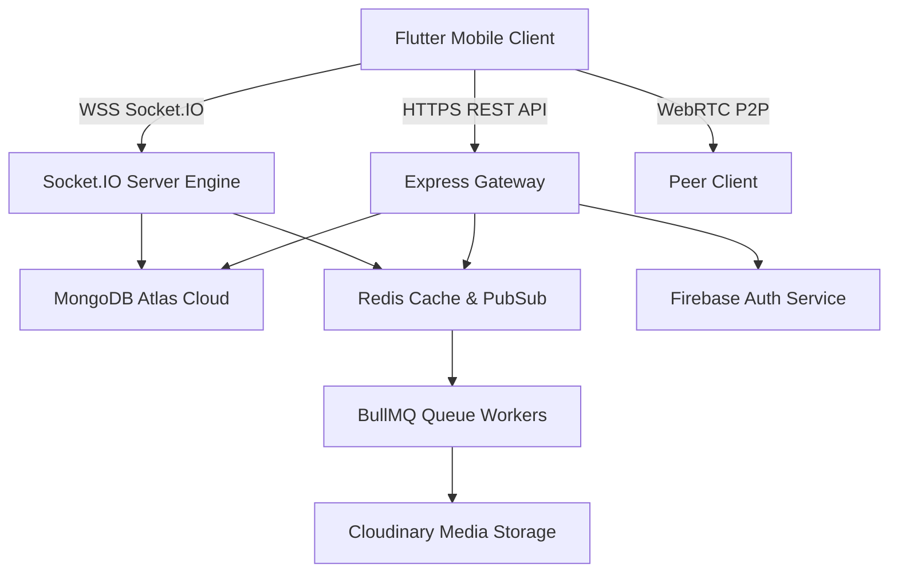

<div align="center">

# 💬 YoumeChat — Enterprise Real-Time Messaging Platform

<p align="center">
  <b>A high-concurrency, cross-platform real-time messaging engine built with Clean Architecture, Socket.IO, WebRTC, and Flutter.</b>
</p>

[](https://github.com/Savio-Shejo/YoumeChat/raw/main/releases/YoumeChat-v1.apk)
[](https://youmechat.onrender.com/health)
[](LICENSE)

<br/>

### 📱 [📥 Download YoumeChat v1.apk — 18.7 MB (Fast Download)](https://github.com/Savio-Shejo/YoumeChat/raw/main/releases/YoumeChat-v1.apk)

---

</div>

## 🌐 Tech Stack & Ecosystem

<table>
  <tr>
    <td align="center" width="25%">
      
      <br/><b>TypeScript 5.4</b>
      <br/><sub>Strict Type Engine</sub>
    </td>
    <td align="center" width="25%">
      
      <br/><b>Node.js & Express</b>
      <br/><sub>High-Performance API</sub>
    </td>
    <td align="center" width="25%">
      
      <br/><b>Flutter 3.x</b>
      <br/><sub>Cross-Platform Client</sub>
    </td>
    <td align="center" width="25%">
      
      <br/><b>MongoDB Atlas</b>
      <br/><sub>Cloud Database</sub>
    </td>
  </tr>
  <tr>
    <td align="center" width="25%">
      
      <br/><b>Socket.IO 4.7</b>
      <br/><sub>Real-Time WebSockets</sub>
    </td>
    <td align="center" width="25%">
      
      <br/><b>Firebase Auth</b>
      <br/><sub>Google OAuth & JWT</sub>
    </td>
    <td align="center" width="25%">
      
      <br/><b>Docker & Compose</b>
      <br/><sub>Containerized Engine</sub>
    </td>
    <td align="center" width="25%">
      
      <br/><b>Redis + BullMQ</b>
      <br/><sub>Async Task Pipelines</sub>
    </td>
  </tr>
</table>

---

## ✨ Key Features & Capabilities

- ⚡ **Instant Real-Time Messaging**: Low-latency bidirectional event communication via Socket.IO.
- 🔐 **Enterprise Authentication**: Google OAuth 2.0 via Firebase & backend custom JWT access/refresh token rotation.
- 📞 **WebRTC Audio & Video Calls**: Peer-to-peer signaling engine supporting `call_invite`, `call_accept`, `call_reject`, and `call_end`.
- 👥 **Group Chats & Member Roles**: Admin moderation, member management, and role-based permissions.
- 🔍 **User Search & Contacts System**: Real-time user lookup, friend requests, contact lists, and blocking.
- ✍️ **Typing Indicators & Read Receipts**: Live typing feedback, online/offline status, and message read confirmations.
- 🛡️ **Admin Moderation Dashboard**: Real-time analytics, user blocking/unblocking, and audit logs.
- 📊 **Monitoring & Observability**: Pino structured log streams (`auth.log`, `socket.log`, `database.log`), Prometheus `/metrics`, and Sentry error tracking.

---

## 📐 System Architecture



---

## 📂 Project Repository Structure

```text
YoumeChat/
├── 📄 README.md                  # Project Documentation
├── 📄 docker-compose.yml        # Multi-container local production compose
├── 📁 releases/                 # Standalone release binaries
│   └── 📱 YoumeChat-v1.apk      # Compiled Android Release APK
│
├── 📁 backend/                  # Node.js + Express + TypeScript + Socket.IO Server
│   ├── 📁 src/
│   │   ├── 📁 common/           # Pino logger, Prometheus metrics, Sentry, Request ID
│   │   ├── 📁 config/           # DB, Redis, Firebase, Cloudinary, Env configs
│   │   ├── 📁 constants/        # HTTP status, error codes, socket events, roles
│   │   ├── 📁 middlewares/      # Auth, role, error, security, rate limiters
│   │   ├── 📁 modules/          # 21 Feature Modules (auth, users, chats, messages, calls, search...)
│   │   ├── 📁 queues/           # BullMQ queue configurations
│   │   ├── 📁 sockets/          # Socket connection, chat, message & call signaling handlers
│   │   ├── 📁 workers/          # BullMQ queue worker processors (media, push, cleanup)
│   │   ├── 📄 app.ts            # Express application bootstrap
│   │   └── 📄 server.ts         # Server bootup & lifecycle management
│   ├── 📄 Dockerfile
│   └── 📄 package.json
│
└── 📁 frontend/                 # Flutter Material 3 Mobile & Web Client
    ├── 📁 lib/
    │   ├── 📁 core/             # Theme, network, error, storage, constants
    │   ├── 📁 features/         # Auth, Profile, Chat, Group, Admin, Settings
    │   ├── 📁 shared/           # Shared widgets, domain models, design system
    │   ├── 📁 routes/           # GoRouter route management with guards
    │   ├── 📁 services/         # SocketService, Dio ApiClient, SecureStorage
    │   ├── 📁 providers/        # Riverpod global state management
    │   └── 📄 main.dart         # Flutter application entry point
    └── 📄 pubspec.yaml
```

---

## 🛠️ REST API Endpoints Overview

| Method | Endpoint | Description | Auth Required |
| :--- | :--- | :--- | :---: |
| `GET` | `/health` | Server Health & Uptime Status | ❌ |
| `POST` | `/api/v1/auth/google-login` | Firebase Google Auth Token Verification | ❌ |
| `POST` | `/api/v1/auth/logout` | Revoke Refresh Tokens & End Session | ✅ |
| `GET` | `/api/v1/users/profile` | Get Logged-in User Profile | ✅ |
| `GET` | `/api/v1/search` | Search Users by Username or Email | ✅ |
| `GET` | `/api/v1/chats` | List User Active Conversations | ✅ |
| `POST` | `/api/v1/messages` | Send Message (REST Fallback) | ✅ |
| `GET` | `/api/v1/admin/analytics` | Fetch Moderation Analytics | 🛡️ Admin |

---

## 🚀 Getting Started

### Prerequisites
- **Node.js**: v18.x or higher
- **Flutter SDK**: v3.x or higher
- **Docker & Docker Compose** (Optional)

### Option 1: Quick Run via Docker Compose
```bash
docker-compose up --build
```

### Option 2: Local Development Setup

#### 1. Backend Server Setup
```bash
cd backend
npm install
npm run dev
```

#### 2. Flutter Client Setup
```bash
cd frontend
flutter pub get
flutter run
```

---

<div align="center">

### 👨‍💻 Created & Maintained by Savio Shejo

Distributed under the MIT License. See `LICENSE` for more information.

</div>
