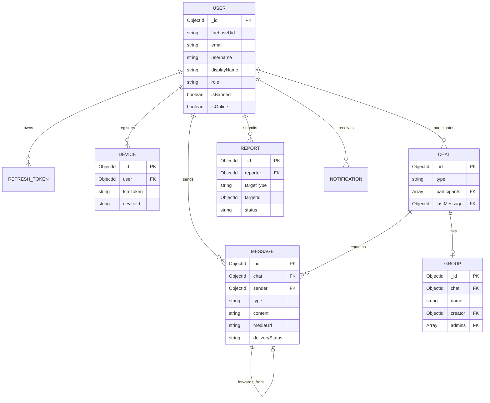

# YoumeChat Entity Relationship Diagram (ERD)

```mermaid
erDiagram
    USER ||--o{ REFRESH_TOKEN : owns
    USER ||--o{ DEVICE : registers
    USER ||--o{ MESSAGE : sends
    USER ||--o{ CHAT : participates
    USER ||--o{ REPORT : submits
    USER ||--o{ NOTIFICATION : receives

    CHAT ||--o{ MESSAGE : contains
    CHAT ||--o| GROUP : links

    MESSAGE ||--o| MESSAGE : replies_to
    MESSAGE ||--o| MESSAGE : forwards_from

    USER {
        ObjectId _id PK
        string firebaseUid
        string email
        string username
        string displayName
        string role
        boolean isBanned
        boolean isOnline
    }

    CHAT {
        ObjectId _id PK
        string type
        Array participants FK
        ObjectId lastMessage FK
    }

    MESSAGE {
        ObjectId _id PK
        ObjectId chat FK
        ObjectId sender FK
        string type
        string content
        string mediaUrl
        string deliveryStatus
    }

    GROUP {
        ObjectId _id PK
        ObjectId chat FK
        string name
        ObjectId creator FK
        Array admins FK
    }

    REPORT {
        ObjectId _id PK
        ObjectId reporter FK
        string targetType
        ObjectId targetId
        string status
    }

    DEVICE {
        ObjectId _id PK
        ObjectId user FK
        string fcmToken
        string deviceId
    }
```
